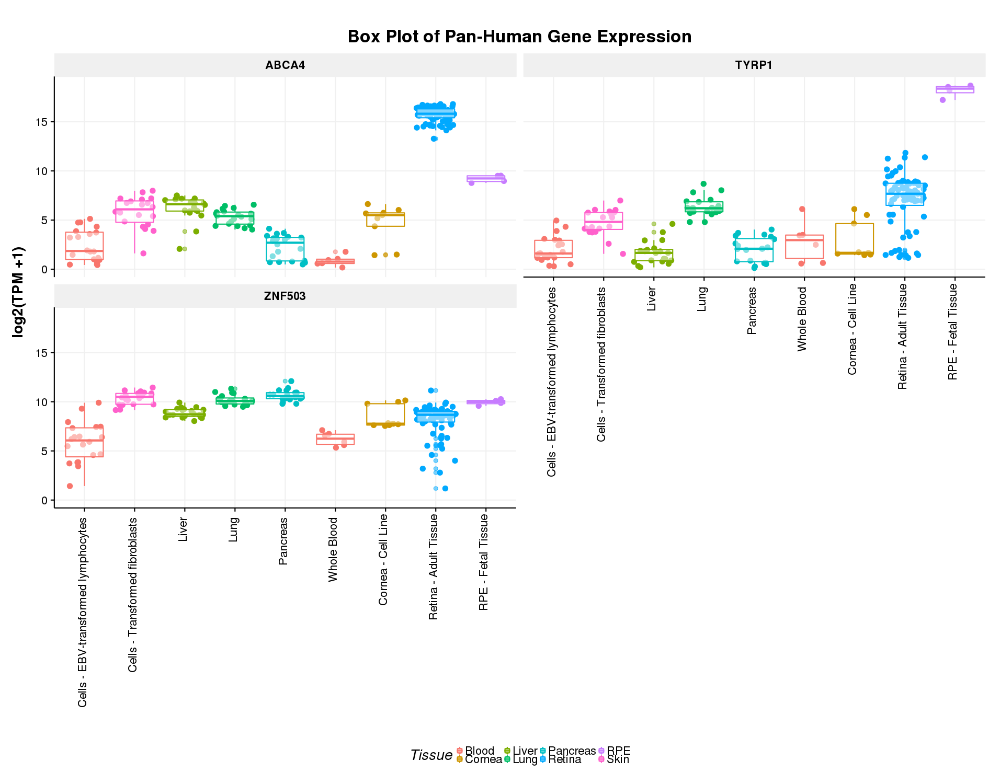

# Introduction
David,
Please see the link below for the paper on Single-Cell retinal sequencing paper.  We can ask the following questions.
Whether Nlz2 present one or more clusters?
Whether Nlz2 present in Amacrine or ganglion cell clusters?
If present, what other transcriptional factors present in those clusters?

http://www.sciencedirect.com/science/article/pii/S0092867415005498

There is another paper on Single-cell sequencing done on Bipolar cell.  See the link below.
http://www.sciencedirect.com/science/article/pii/S0092867416310078

Thanks for your help.

Elan


# Visualization of single cell expression, clustered by t-SNE 
Seurat was used for analysis.

Briefly, the raw counts (P14 mouse retina) data from the Macosko and McCarroll paper were loaded into Seurat and, for visualization purposes, only the `r ncol(retina@data)` cells with 900 or more genes expressed in them were used for initial clustering and visualization. This cut-off was used as the majority of the cells have very little detected gene expression and the clustering was not performing well. 

My clustering results
```{r}
library(cowplot)
library(Seurat)
library(tidyverse)
library(here)
# load processed data from scripts/process_macosko.R
load(here('data/retina_seurat_subSet.Rdata'))
# Choose gene outliers on mean-variability plot
#retina <- FindVariableGenes(object = retina, x.low.cutoff = 0, y.cutoff = 2)
#length(x = retina@var.genes)

# elbow at 30
#PCElbowPlot(object = retina, num.pc = 40)
#PrintPCA(object = retina, pcs.print = 1:36)
#PCHeatmap(object = retina, pc.use = 1:12,100)
#PCHeatmap(object = retina, pc.use = 13:24,100)
#PCHeatmap(object = retina, pc.use = 25:36,100)

#VizPCA(object = retina, pcs.use = 1:2)

TSNEPlot(object = retina, do.label = TRUE)
```

As Macosko et al. have done the difficult work of classifying the cell types already, I will be using their cell classifications from now on. 

# Macosko Cluster and Cell Type Table/Key
```{r}
source('scripts/macosko_cluster_assignments.R')
macosko_cluster %>% group_by(Macosko_Clusters) %>%  summarise(`Cell Type` = paste(unique(`Cell Type`), collapse = ','))%>% arrange(Macosko_Clusters) %>% DT::datatable(options=list(pageLength = 40))
```

To make sure that my clustering approximately matches the Macosko assignments, I have replotted the t-SNE plot from above, this time with the Macosko cell group assignments. They look pretty good, so it seems reasonable to use them. 

# Cell clustering with  Macosko et al. assignments
```{r, fig.height=4, fig.width=4}
# remove cells that Macosko did not classify
notNA <- retina@meta.data[!is.na(retina@meta.data$Macosko_Clusters),] %>% rownames()
retina_s <- SubsetData(retina, cells.use = notNA)

#print with macosko clustering
TSNEPlot(object = retina_s, do.label = TRUE, group.by = 'Macosko_Clusters')
```

# Plot retina marker genes and ZFP503. 

I can add any other genes you would like to see. 

Two points:

1. Not that many ZFP503 cells
2. Many of them are in cluster 9 (top), which is an Amacrine population
```{r, fig.width=4, fig.height=4}
# plot individual genes
FeaturePlot(object = retina, features.plot = c("PAX6", "VSX2", "OPN1MW", "RLBP1","NRL","SLC17A6","CRX","ZFP503"), 
            pt.size = 0.1,
            cols.use = c("gray", 
                         "blue"))
```


# Number of cells with detectable ZFP503 Expression. 

`r table(retina_superset@data['ZFP503',] > 0.1)['TRUE']` cells out of `r ncol(retina_superset@data)` have detectable ZFP503 expression. Not many. This doesn't seem to be a very highly expressed gene. This is corroborated by looking at ZNF503 expression in eyeIntegration



```{r}
load(here('data/retina_seurat_superSet.Rdata'))

table(retina_superset@data['ZFP503',] > 0.1)
```

# Expression of key retinal markers in ZFP503 positive cells
```{r}
zfp503_pos_cells <- colnames(retina_superset@data)[retina_superset@data['ZFP503',] > 0.1]
zfp503_pos_cells_TF <- retina_superset@data['ZFP503',] > 0.1
zfp503_STRONGLYpos_cells <- colnames(retina_superset@data)[retina_superset@data['ZFP503',] > 1]

#retina_superset@data[c("POU4F1", "CALB2", "ISL1", "LHX2","PAX6", "VSX2", "OPN1MW", "RLBP1","NRL","SLC17A6","CRX","ZFP503"), zfp503_pos_cells] %>% as.matrix() %>% data.frame() %>% rownames_to_column('Gene') %>% gather('cell_id', 'Expression', -Gene) %>% ggplot(aes(x=Gene, y=Expression)) + geom_violin() + geom_jitter(alpha=0.2) + theme(axis.text.x = element_text(angle = 90, hjust = 1)) + coord_cartesian(ylim=c(0,20))

retina_superset@data[c("POU4F1", "CALB2", "ISL1", "LHX2","PAX6", "VSX2", "OPN1MW", "RLBP1","NRL","SLC17A6","CRX","ZFP503"), zfp503_pos_cells] %>% as.matrix() %>% data.frame() %>% rownames_to_column('Gene') %>% gather('cell_id', 'Expression', -Gene) %>% ggplot(aes(x=Gene, y=Expression)) + geom_boxplot() + geom_jitter(alpha=0.2) + theme(axis.text.x = element_text(angle = 90, hjust = 1, vjust=0.5)) + coord_cartesian(ylim=c(0,20))
```

# Macosko Clustering cell type assignments for ZFP503

Amacrine enrichment. Also in the rods, but at a lower proportion than you would expect by chance. 
```{r}
zfp503_counts <- retina_superset@meta.data[zfp503_pos_cells,'Cell Type'] %>% table() %>% as.data.frame() %>% arrange(-Freq) %>% mutate(`ZFP503 Count` = Freq, `ZFP503+ Freq`=Freq/length(zfp503_pos_cells)) %>% select(-Freq)
all_counts <-  retina_superset@meta.data[,'Cell Type'] %>% table() %>% as.data.frame() %>% arrange(-Freq) %>% mutate(`All Counts` = Freq, `All Freq`=Freq/ncol(retina_superset@data)) %>% select(-Freq)
left_join(zfp503_counts, all_counts, by=c('.'='.')) %>% DT::datatable(options=list(pageLength=25))

```

# Differential Expression
Find differentially expressed genes in ZFP503 positive cells relative to non-ZFP503 expressing cells. pct.1 is the percentage of ZFP503+ cells that the gene is expressed in. pct.2 are the ZFP503- cells. The p_val is calculated off of the avg_diff stat, which measures the strength of expression. So you will see genes that don't have a large difference in percentage of cells expression (pct.1 and pct.1), but have a very low p_val. A positive avg_diff means that the gene is more highly expressed in the ZFP503+ cells. 
```{r}
retina_zfp503 <- retina_superset
zfp503_tf <- retina_superset@data['ZFP503',] > 0.1
zfp503_tf <- gsub(TRUE, 1, zfp503_tf)
zfp503_tf <- gsub(FALSE, 0, zfp503_tf)
names(zfp503_tf) <- names(retina_superset@ident)
zfp503_tf <- as.factor(zfp503_tf)
retina_zfp503@ident <- zfp503_tf

zfp503_markers <- FindMarkers(object = retina_zfp503, ident.1 = 1)

zfp503_markers %>% DT::datatable()

```

# SessionInfo
```{r}
sessionInfo()
```
